# PLC & MPS Based Automatic Material Sorting and Storage System

[Korean README](./README.md)


> **Note**  
> The README descriptions are provided in English, but the screenshots, ladder-logic images, HMI screens, and GIF captions are available in Korean only.

---


## Project Overview

This project implements an automated material sorting, storage, and discharge system using a Mitsubishi PLC and MPS equipment.

The system classifies materials as metal or non-metal and stores or discharges them automatically according to the classification result and work count.

The full process, including material supply, processing, transfer, classification, suction pick-up, storage, and discharge, was controlled using PLC ladder logic.  
A servo motor was used for precise positioning according to warehouse height, and an HMI was designed to support real-time monitoring, operation selection, parameter adjustment, JOG control, and Teaching functions.

---

## Project Goals

The main goals of this project are:

- Classify materials as metal or non-metal
- Automatically determine warehouse positions according to material type and count
- Control servo motor positioning using the QD77MS2 positioning module
- Implement automatic homing after power-on
- Implement HMI-based real-time monitoring and operation control
- Implement manual JOG control and servo position Teaching
- Implement operation check, automatic operation, selective storage, full empty, and selective empty modes
- Implement emergency stop and emergency reset logic
- Measure Tact Time for operation monitoring
- Improve safety, usability, and maintainability of the automation system

---

## Development Environment

### Hardware

| Category | Model / Description |
|---|---|
| PLC CPU | Mitsubishi Q03UDV |
| Positioning Module | QD77MS2 |
| HMI | GOT GT2710-STBA |
| Equipment | MPS Automation Equipment |
| Motion Device | Servo Motor |
| Actuator | Supply Cylinder, Processing Cylinder, Distribution Cylinder, Stopper Cylinder, Suction Cylinder, Warehouse Cylinder |
| Sensor | Material Detection Sensor, Metal Detection Sensor, Cylinder Position Sensor, Stopper Sensor |
| Motor | Drill Motor, Conveyor Motor |

### Software

| Software | Version / Model |
|---|---|
| GX Works2 | Ver. 1.631H |
| GT Designer3 | GT2710-STBA |
| PLC Programming | Ladder Logic |
| HMI Design | GOT Screen Design |

### PLC I/O Assignment

> The following image is provided in Korean only.

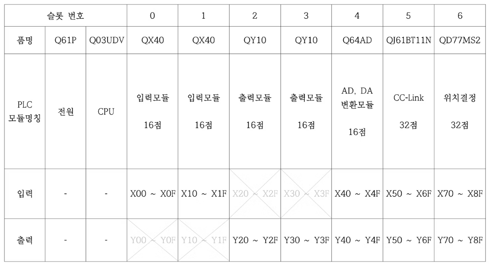

---

## System Structure

```text
[Material Supply]
        ↓
[Processing Cylinder + Drill Motor]
        ↓
[Distribution Cylinder]
        ↓
[Conveyor Transfer]
        ↓
[Metal / Non-metal Classification]
        ↓
[Stopper Cylinder]
        ↓
[Servo Motor Positioning]
        ↓
[Suction Module Pick-up]
        ↓
[Warehouse Storage]
        ↓
[Discharge when Storage Limit is Exceeded]
```

### Overall Flow Chart

> The flow chart image is provided in Korean only.

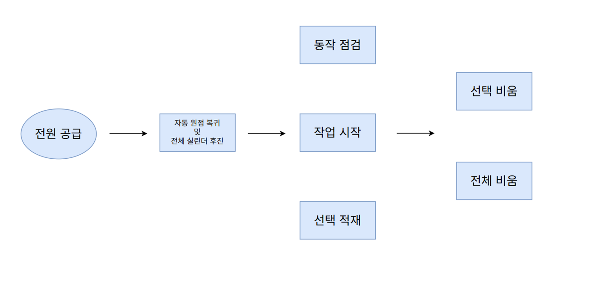

---

## Main Features

## 1. Automatic Homing after Power-on and Operation Ready Conditions

When power is supplied, the servo motor automatically returns to its origin position.

After homing is completed, the following actions are performed:

- `M0` turns ON
- The origin-established lamp on the HMI turns ON
- All cylinders return to their backward positions
- The equipment moves to a safe initial state

For example, the supply cylinder backward output `Y21` was controlled using the B-contact of `M0`.  
Before `M0` turns ON, the backward signal of the supply cylinder is maintained.  
After the origin is established, the backward signal is turned OFF.

This prevents the equipment from starting operation from an unknown or unsafe position immediately after power-on.

> The following ladder-logic images are provided in Korean only.

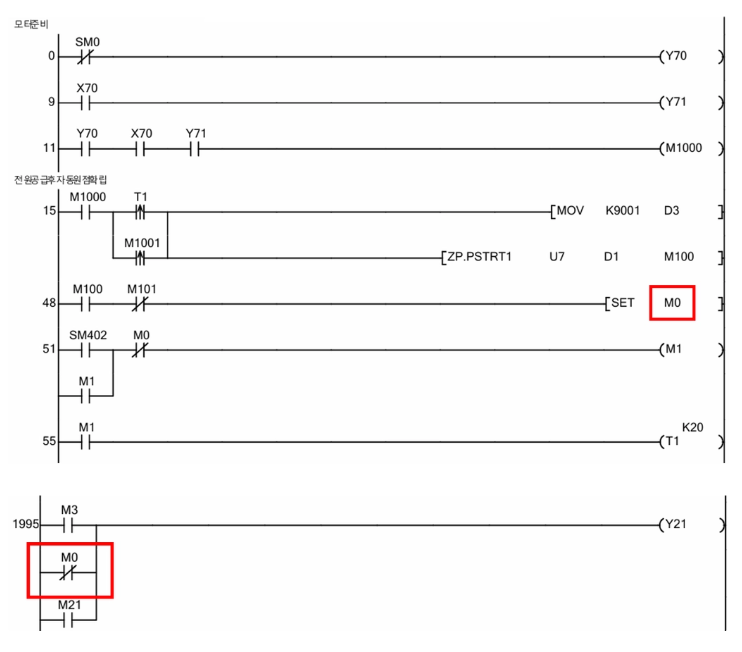

### Operation Ready Conditions

The system can operate only when all of the following conditions are satisfied:

- Servo motor origin is established
- All cylinders are in the backward position
- Material supply is detected
- Emergency state is not active

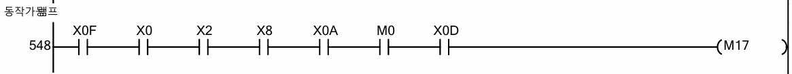

When these conditions are satisfied, the operation-ready lamp `M17` turns ON on the HMI.

---

## 2. Operation Check Mode

Operation Check Mode sequentially checks the operating status of cylinders, the drill motor, and the conveyor motor.

> The following ladder-logic image is provided in Korean only.

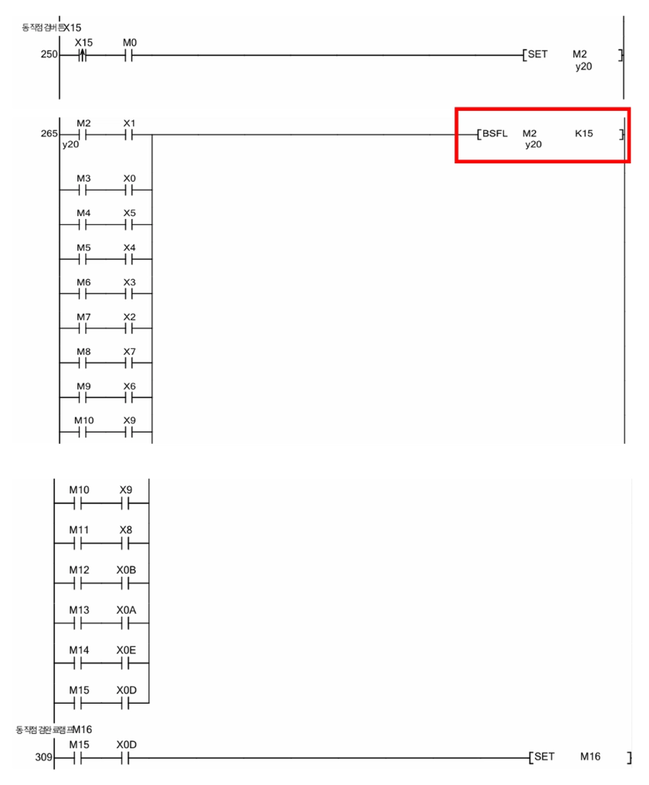

When the operation check button `X15` is pressed, the inspection sequence starts.

### Check Sequence

1. Supply cylinder forward / backward
2. Processing cylinder down / up
3. Drill motor ON / OFF
4. Distribution cylinder forward / backward
5. Conveyor motor ON / OFF
6. Discharge cylinder forward / backward
7. Stopper cylinder forward / backward
8. Suction cylinder forward / backward
9. Warehouse cylinder forward / backward

Each step includes a completion sensor condition.  
Therefore, the next step does not start until the current movement is fully completed.

When the inspection is completed, the operation-check-complete lamp `M16` turns ON.

### Operation Check GIF

> The GIF is provided with Korean labels only.


---

## 3. Automatic Operation Mode

Automatic Operation Mode executes the full sequence from material supply to storage or discharge.

When the work start button `X16` is pressed, automatic operation starts.

> The following sequence image is provided in Korean only.

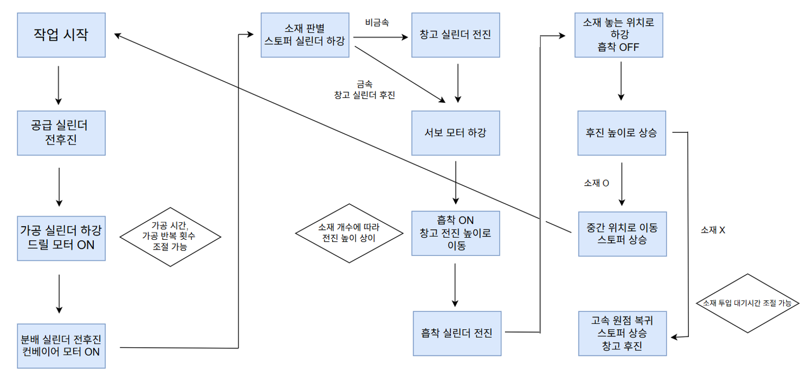

### Full Automatic Operation Video

[Watch Full Automatic Operation Video](https://drive.google.com/file/d/1w_E2pjcpxAljvRO91MlLiYkNVass84lW/view?usp=sharing)

### Automatic Operation Sequence

1. Supply cylinder supplies the material
2. Processing cylinder moves down
3. Drill motor turns ON
4. Processing is performed for the configured time
5. Processing repeats according to the configured repeat count
6. Processing cylinder moves up and the drill motor turns OFF
7. Distribution cylinder transfers the material to the conveyor
8. Conveyor operates
9. Metal / non-metal classification is performed
10. Stopper cylinder stops the material at the pick-up position
11. Servo motor moves to the material pick-up position
12. Suction module turns ON
13. Servo motor moves to the target warehouse height
14. Suction cylinder moves forward
15. Servo motor moves slightly down to place the material
16. Suction module turns OFF
17. Servo motor moves slightly up
18. Suction cylinder moves backward
19. The system returns to the next waiting position or origin position

Processing time and repeat count can be changed from the HMI.

---

## 4. Material Classification and Storage Logic

Materials are classified into two types:

- Metal
- Non-metal

Each material type is counted using a separate counter.

### Material Classification and Warehouse Storage Position

> The following images are provided in Korean only.

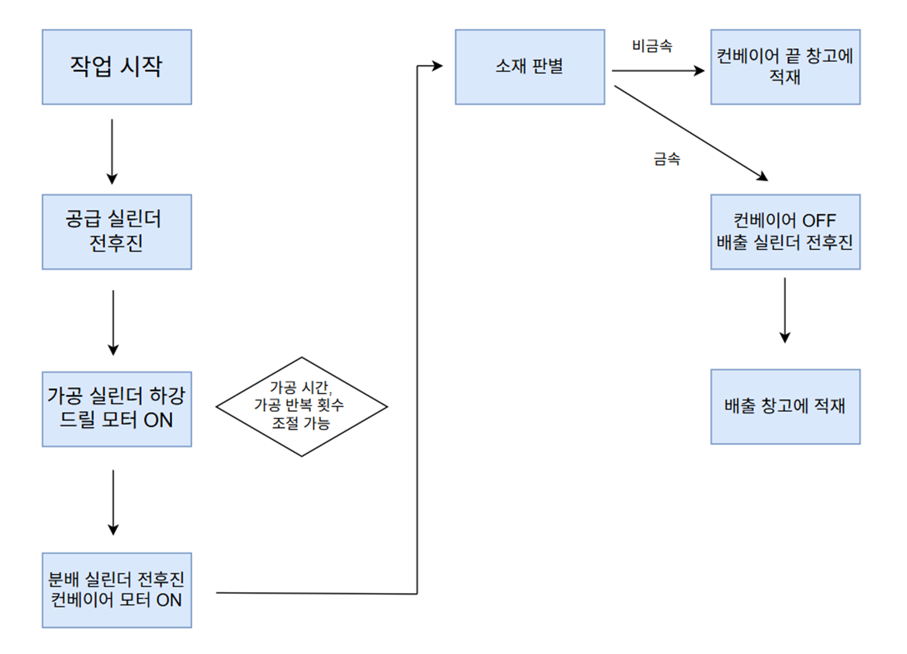

| Material Type | Counter |
|---|---|
| Metal | `C50` |
| Non-metal | `C51` |

### C50 and C51 Counter Logic

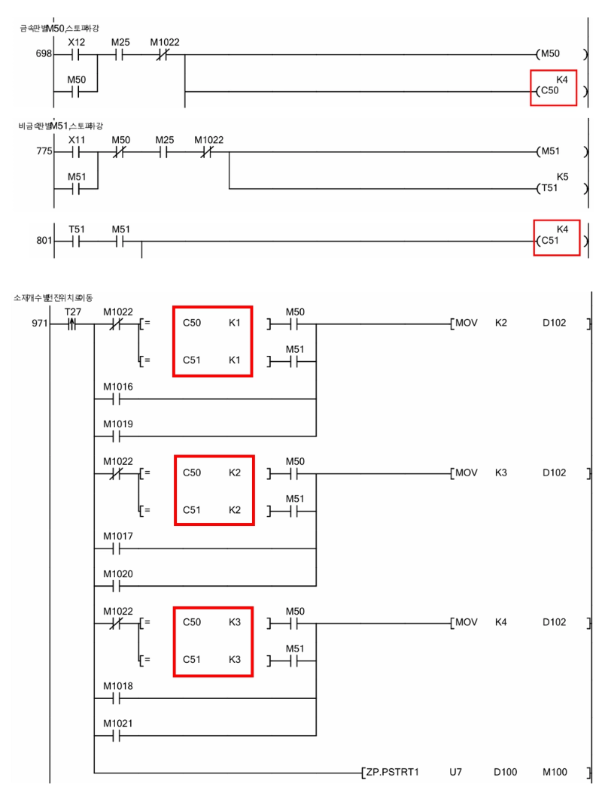

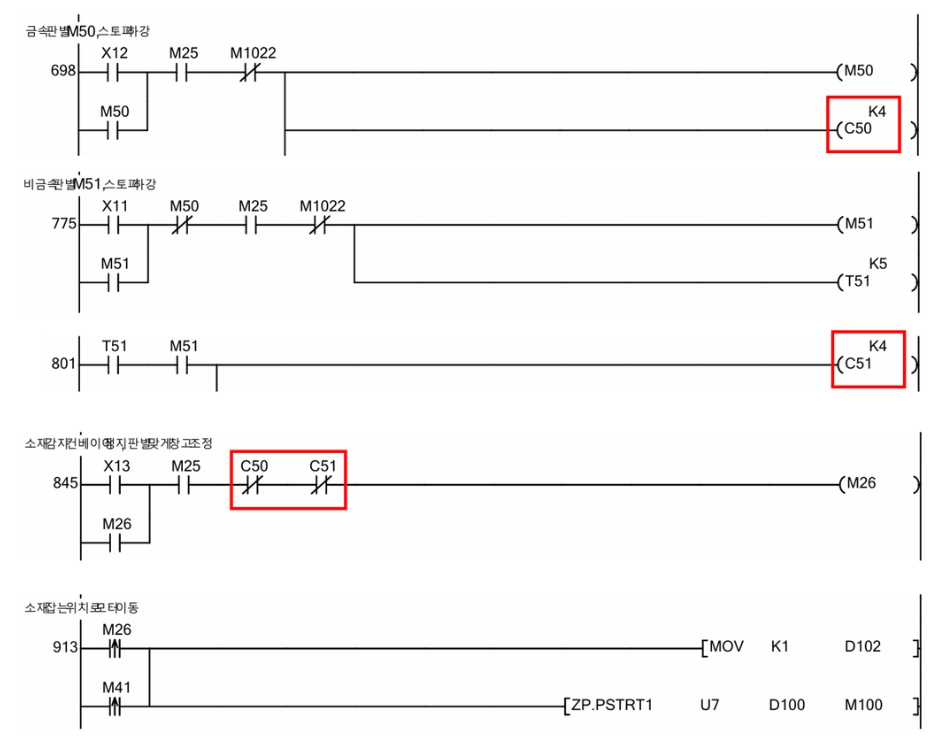

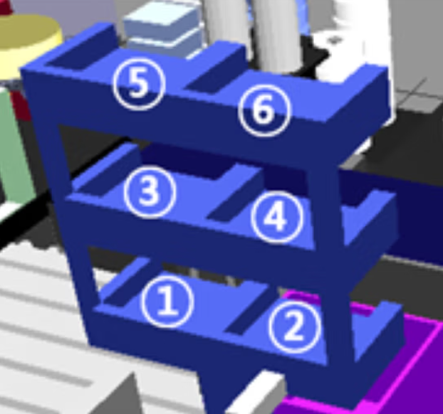

### Metal Material Storage

| Count | Storage Position |
|---|---|
| 1st metal | 1 |
| 2nd metal | 3 |
| 3rd metal | 5 |

### Non-metal Material Storage

| Count | Storage Position |
|---|---|
| 1st non-metal | 2 |
| 2nd non-metal | 4 |
| 3rd non-metal | 6 |

Each material type can be stored up to three times.

From the 4th material, the material is not stored in the warehouse and is discharged instead.

- 4th metal material: moved to the discharge warehouse by the discharge cylinder
- 4th non-metal material: moved to the warehouse at the end of the conveyor

The B-contacts of `C50` and `C51` were used to prevent the existing storage sequence from running after the storage limit is reached.  
Therefore, from the 4th material, once `C50` or `C51` is activated by classification, the existing sequence is interrupted.

---

## 5. Servo Motor Position Control

The servo motor was controlled through the QD77MS2 positioning module.

> The following images are provided in Korean only.


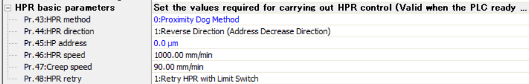

The servo motor moves to the following major positions:

- Origin position
- Material pick-up position
- 1st-floor warehouse forward height
- 2nd-floor warehouse forward height
- 3rd-floor warehouse forward height
- Slight downward position for placing material
- Slight upward position for suction cylinder retreat

Incremental position movement was used when picking up or placing materials.  
This made it possible to perform small downward or upward movements from each floor height using only one absolute position data value for each floor.

---

## 6. HMI Monitoring and Control

The HMI was designed so that the equipment status can be monitored in real time and the user can directly control the operation.

> HMI screens and ladder-logic images are provided in Korean only.

| HMI 1 | HMI 2 | HMI 3 |
|---|---|---|
| 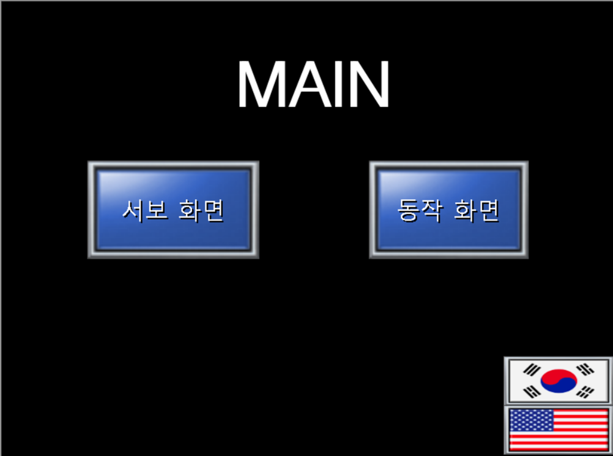 | 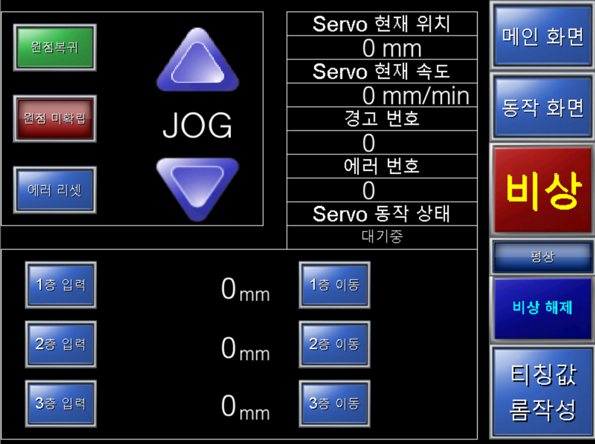 | 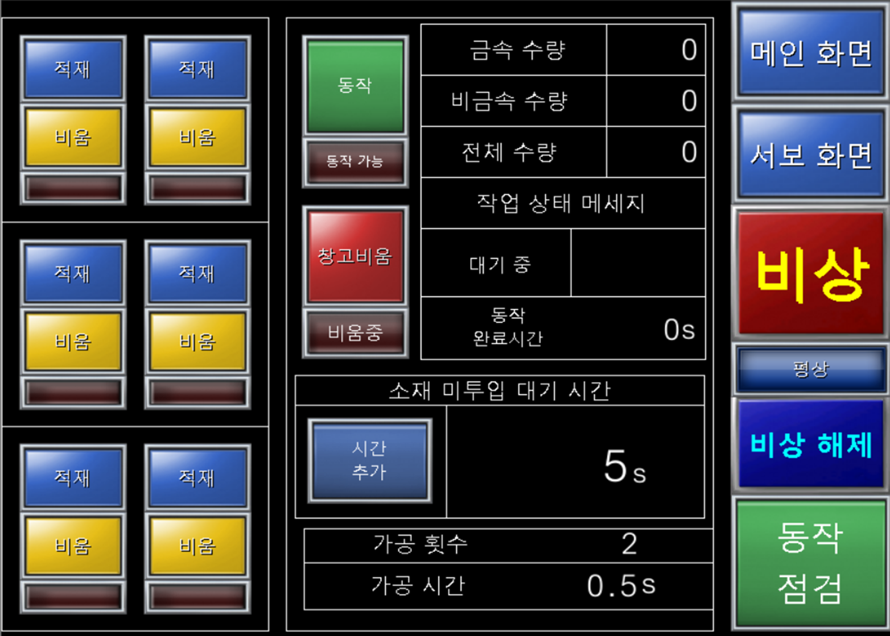 |

### Main HMI Functions

- Korean / English language switching
- Automatic operation start
- Operation check start
- Selective storage
- Full empty
- Selective empty
- Emergency stop
- Emergency reset
- Error reset
- Servo JOG up / down
- Servo position Teaching
- Processing time setting
- Processing repeat count setting
- Material re-input waiting time setting
- Tact Time display

### HMI Monitoring Items

- Servo current position
- Servo current speed
- Servo operation status
- Warning number
- Error number
- Metal / non-metal classification result
- Metal count
- Non-metal count
- Total work count
- Work status message
- Warehouse storage lamps
- Tact Time

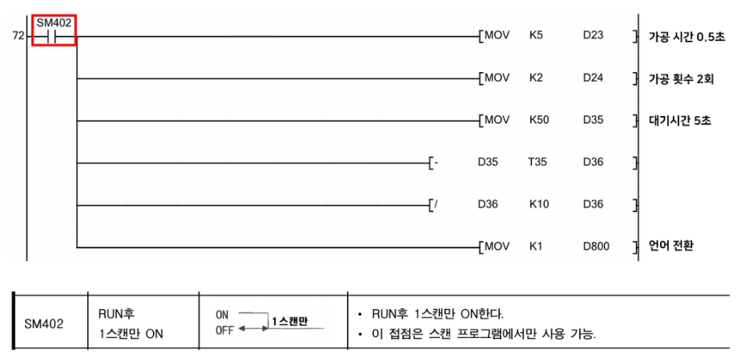

According to page 795 of the Mitsubishi Electric QCPU/QnACPU Programming Manual, the special relay `SM402` turns ON for only one scan after RUN.  
Therefore, this special relay was used to initialize the required values.

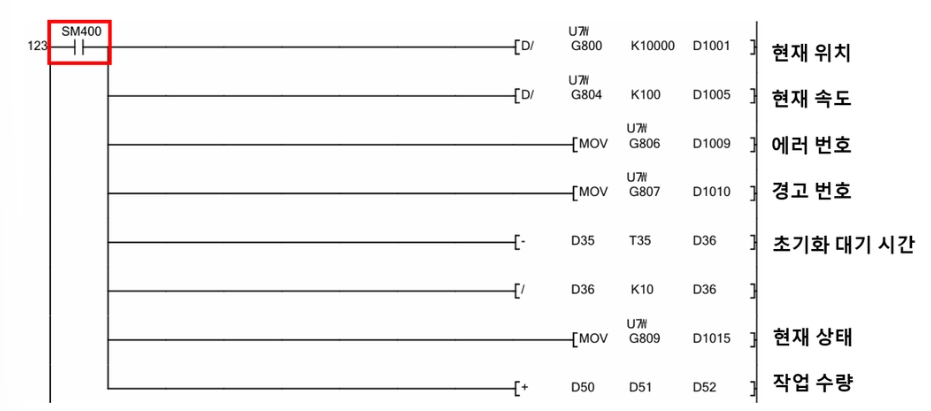
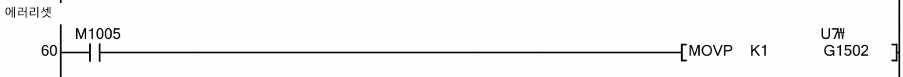
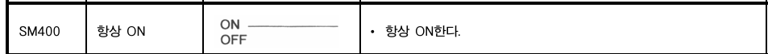

`D50` represents the metal count, `D51` represents the non-metal count, and `D52` represents the total work count.  
Warning and error numbers are also displayed, and the error reset button `M1005` was added.  
To make servo position Teaching easier, the current servo position and current speed are displayed in real time.  
Since these values must always be monitored, the special relay `SM400` was used.

---

## 7. Selective Storage Mode

> The following images and GIF are provided in Korean only.

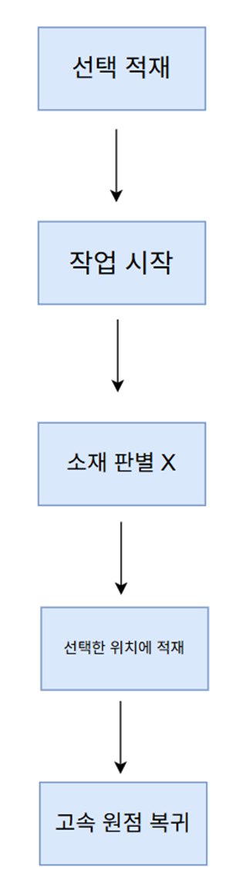

Selective Storage Mode allows the user to store a material in a desired warehouse position regardless of the material classification result.

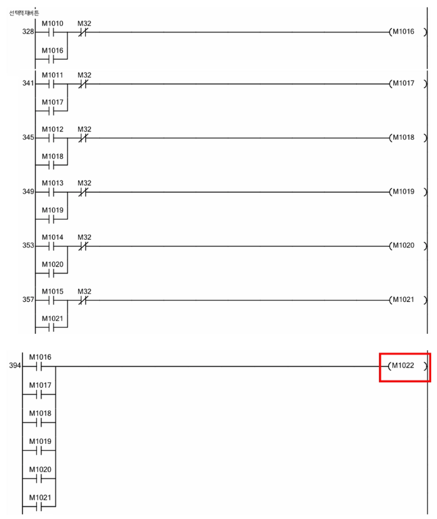

### Selective Storage Buttons

| Memory | Function |
|---|---|
| `M1010` | Store at 1st-floor metal position |
| `M1011` | Store at 2nd-floor metal position |
| `M1012` | Store at 3rd-floor metal position |
| `M1013` | Store at 1st-floor non-metal position |
| `M1014` | Store at 2nd-floor non-metal position |
| `M1015` | Store at 3rd-floor non-metal position |

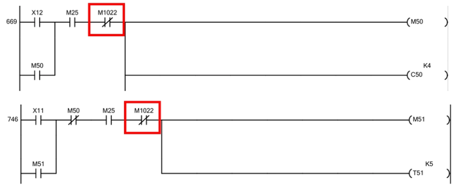

`M1022` indicates Selective Storage Mode.  
The B-contact of `M1022` prevents the normal automatic classification-based storage sequence from running during selective storage.

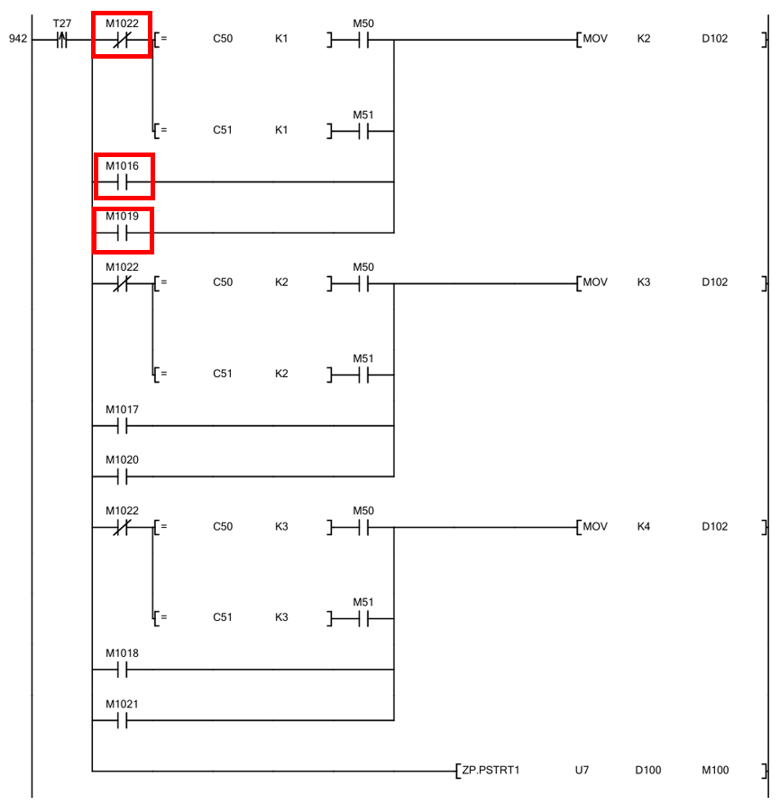

### Selective Storage GIF

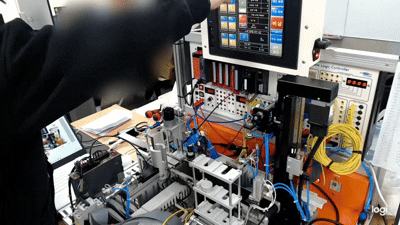

---

## 8. Full Empty Mode

> The following images and GIF are provided in Korean only.

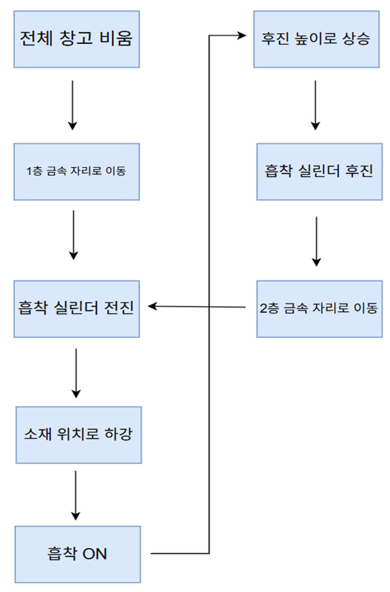

Full Empty Mode discharges all six materials stored in the warehouse in a fixed order.

### Full Empty Order

1. 1st-floor metal position
2. 2nd-floor metal position
3. 3rd-floor metal position
4. 1st-floor non-metal position
5. 2nd-floor non-metal position
6. 3rd-floor non-metal position

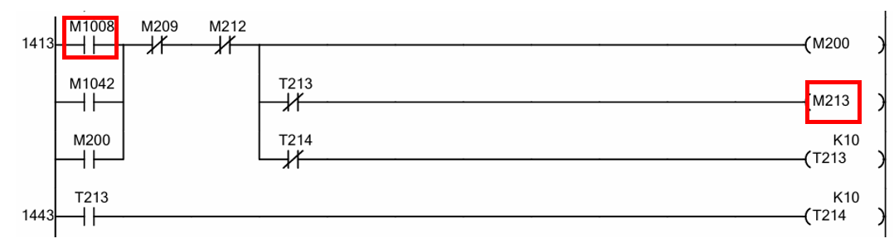

Full Empty starts with the `M1008` button.

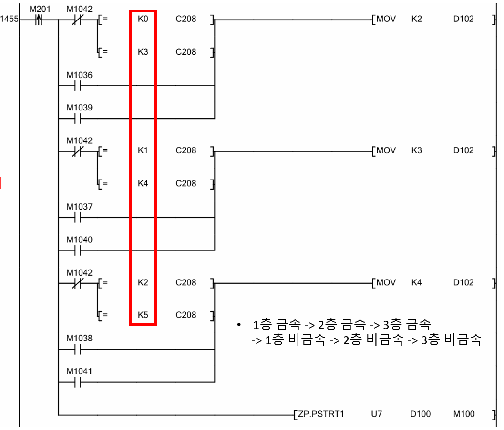

During Full Empty operation:

- The `M213` lamp blinks every second
- The HMI displays that the empty operation is in progress
- `C208` counts the number of completed empty operations
- The next servo target position is selected according to the `C208` value

### Full Empty GIF


---

## 9. Selective Empty Mode

Selective Empty Mode discharges only the material stored in the selected warehouse position.

> The following images and GIF are provided in Korean only.

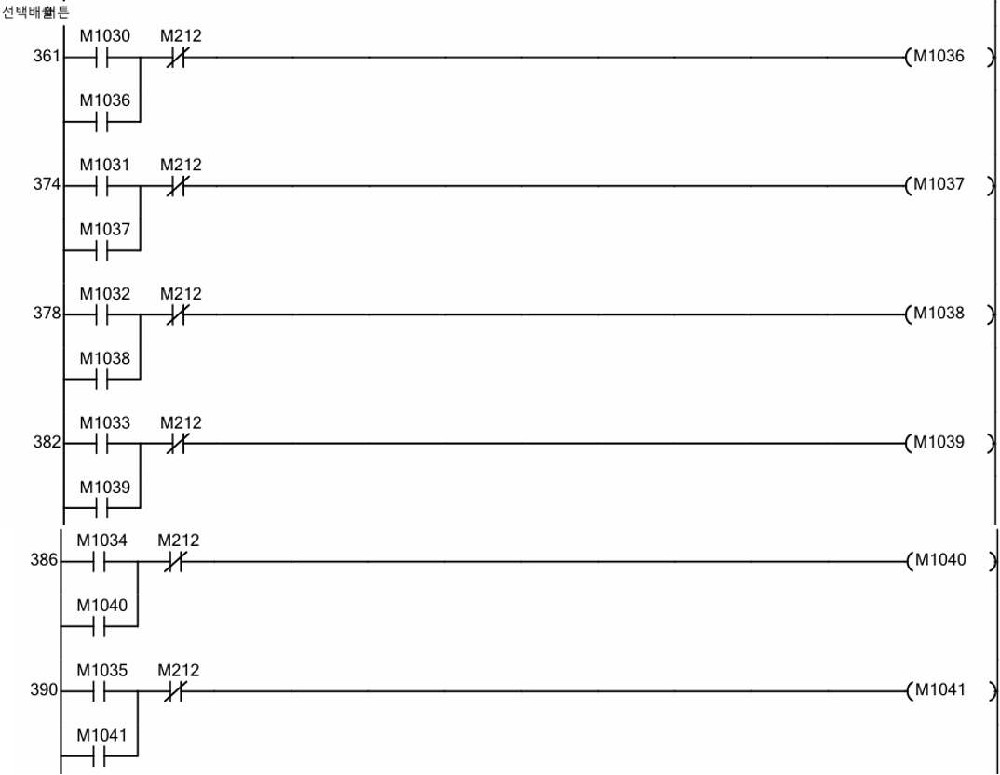

### Selective Empty Buttons

| Memory | Function |
|---|---|
| `M1030` | Empty 1st-floor metal position |
| `M1031` | Empty 2nd-floor metal position |
| `M1032` | Empty 3rd-floor metal position |
| `M1033` | Empty 1st-floor non-metal position |
| `M1034` | Empty 2nd-floor non-metal position |
| `M1035` | Empty 3rd-floor non-metal position |

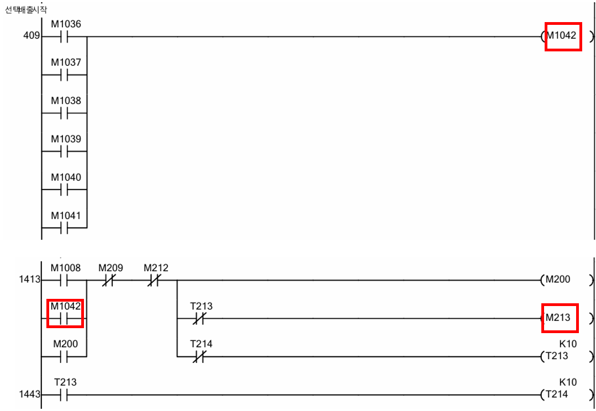

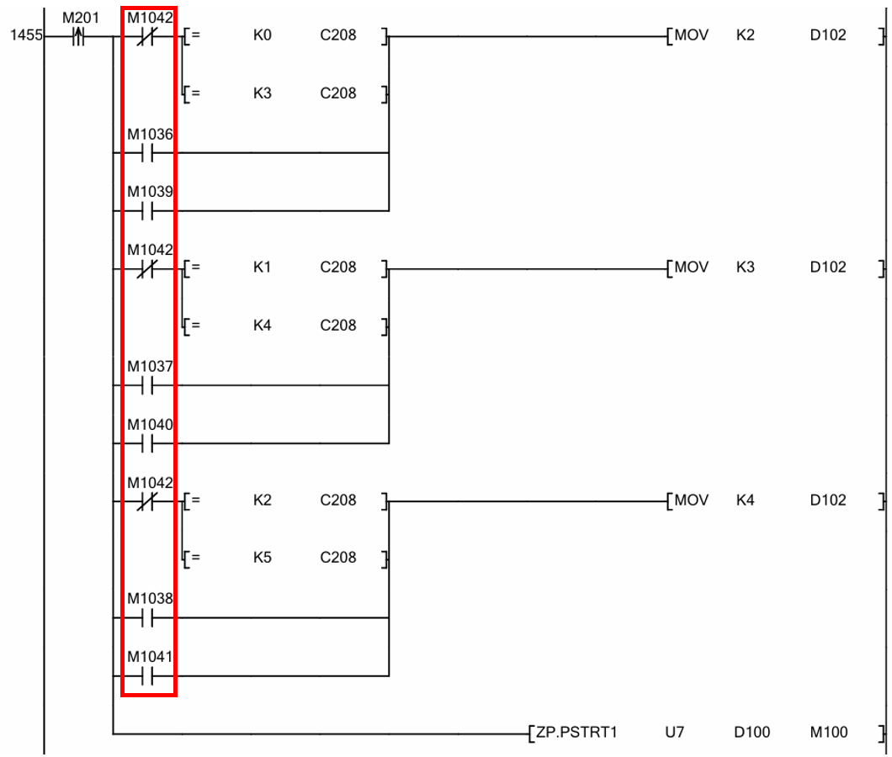

`M1042` was used to distinguish Selective Empty Mode from Full Empty Mode.  
During Selective Empty operation, `M213` also blinks to indicate the operation status.

### Selective Empty GIF


---

## 10. Servo Position Teaching Function

The HMI allows the user to directly teach the warehouse forward positions of the servo motor.

> The following images are provided in Korean only.

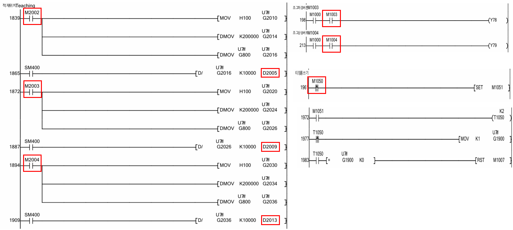

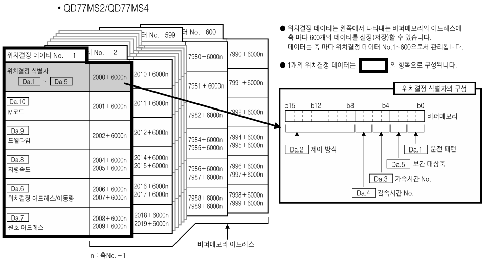

### Teaching Buttons

| Memory | Function |
|---|---|
| `M1003` | JOG Down |
| `M1004` | JOG Up |
| `M1050` | Write position data to ROM |
| `M2002` | Teach 1st-floor warehouse forward height |
| `M2003` | Teach 2nd-floor warehouse forward height |
| `M2004` | Teach 3rd-floor warehouse forward height |

### Teaching Data Display

| Device | Meaning |
|---|---|
| `D2005` | 1st-floor warehouse forward height |
| `D2009` | 2nd-floor warehouse forward height |
| `D2013` | 3rd-floor warehouse forward height |

This allows the user to adjust the position directly from the HMI even when the equipment structure or material position changes.

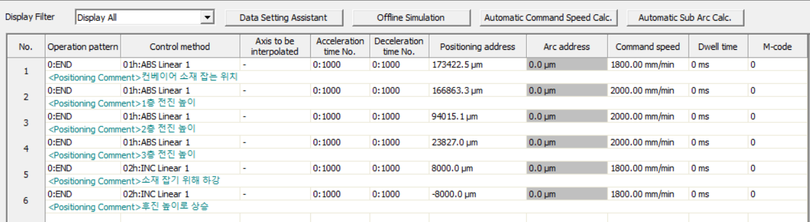

---

## 11. Warehouse Lamp Logic

Warehouse lamps are HMI indicators used to check whether each storage position is occupied.

> The following images are provided in Korean only.

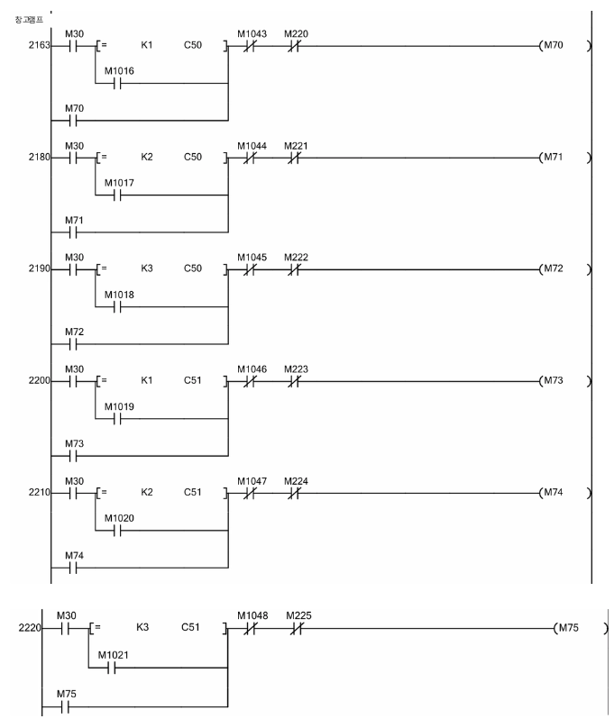

| Memory | Warehouse Position |
|---|---|
| `M70` | 1st-floor metal position |
| `M71` | 2nd-floor metal position |
| `M72` | 3rd-floor metal position |
| `M73` | 1st-floor non-metal position |
| `M74` | 2nd-floor non-metal position |
| `M75` | 3rd-floor non-metal position |

When a material is stored, the corresponding lamp turns ON.  
When a material is discharged, the corresponding lamp turns OFF.

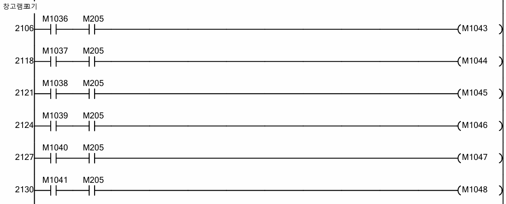

Additional auxiliary memories and B-contacts were added so that the lamps turn OFF correctly during Selective Empty and Full Empty operations.

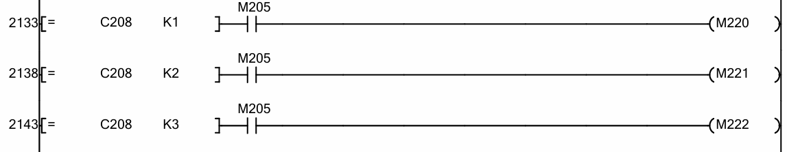

For Full Empty operation, new memory logic was created using the empty count `C208`, and the lamps were turned OFF using B-contacts in the same way as Selective Empty operation.

---

## 12. Emergency Stop and Safety Design

Emergency stop and emergency reset buttons were added to the HMI.

> The following images and GIF are provided in Korean only.

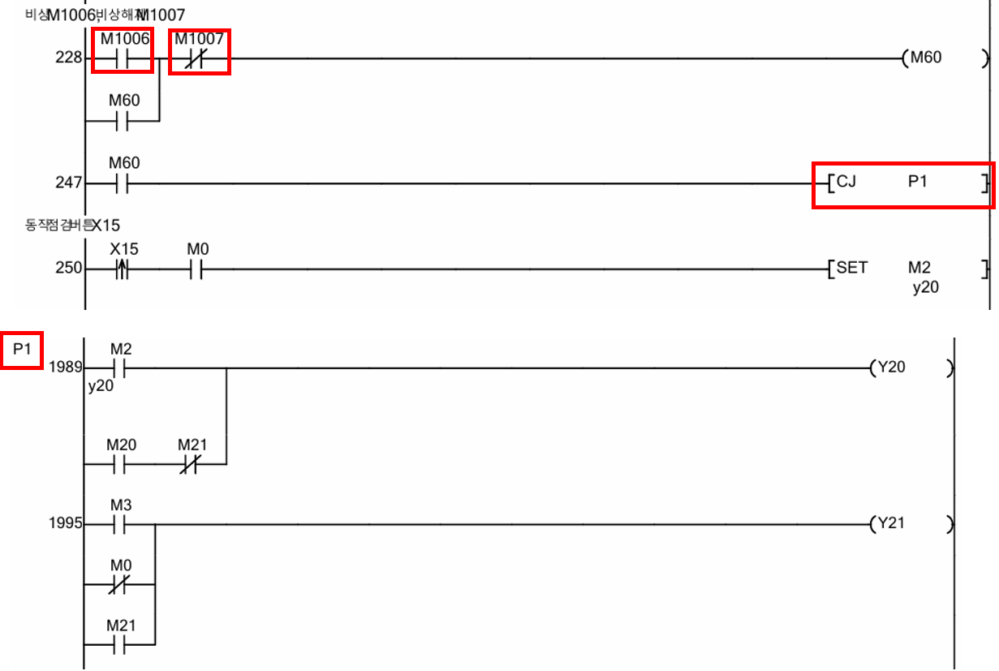
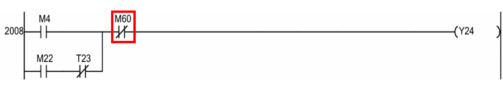

| Memory | Function |
|---|---|
| `M1006` | Emergency Stop |
| `M1007` | Emergency Reset |
| `M60` | Emergency state memory |

When the emergency button is pressed, the following actions are performed:

- All operation sequences stop
- Cylinder movements stop
- Servo motor axis stop is executed
- Drill motor stops
- Processing cylinder immediately moves upward
- The program jumps to the output control section using the `CJ` instruction

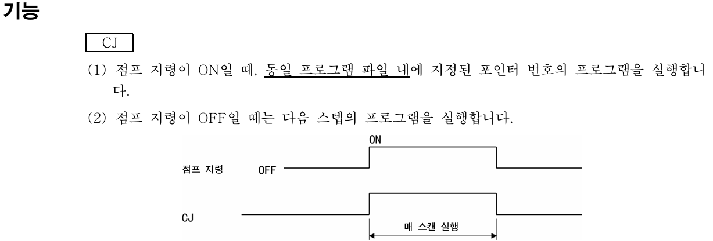
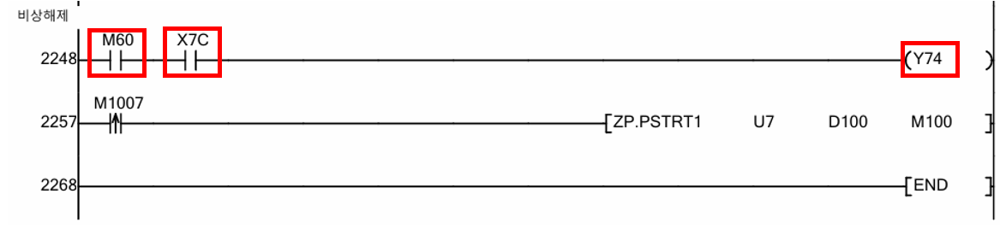
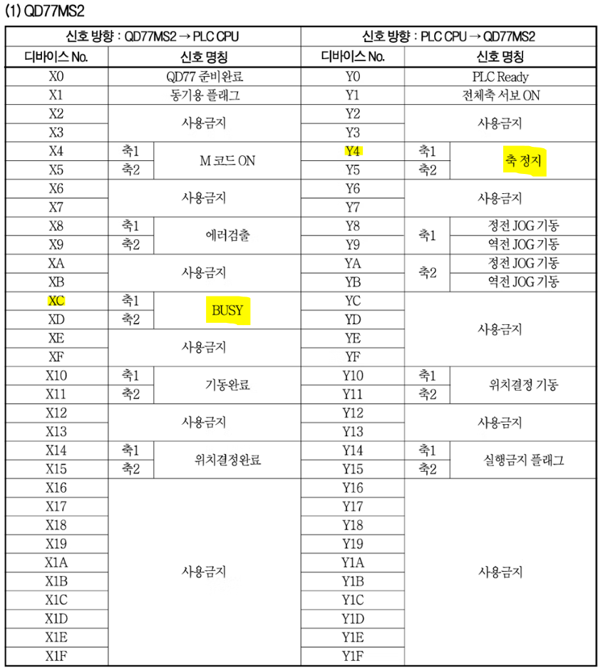

The emergency logic was designed to have the highest priority in the entire program.

### Emergency Stop GIF


---

## 13. Servo Limit Safety

> The following images are provided in Korean only.

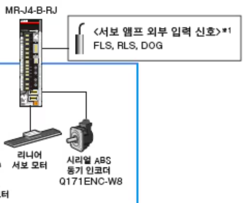

The servo motor has FLS and RLS limit sensors.  
These sensors detect when the axis approaches the mechanical movement limit.

The limit safety circuit uses B-contacts.

B-contacts were used because the circuit becomes open when a wire is disconnected, allowing the system to detect an abnormal state.  
If A-contacts were used, the system might not detect a broken wire, which can be dangerous.

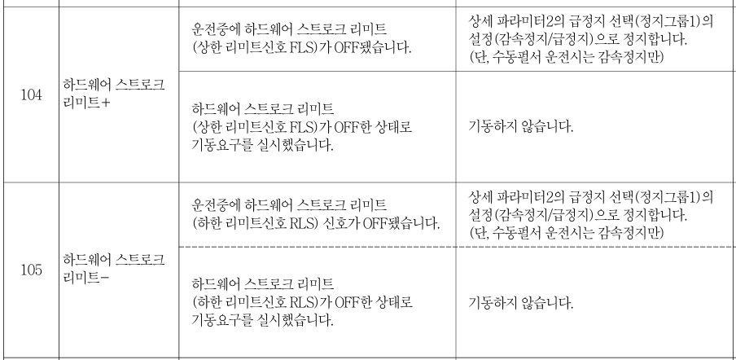

According to the QD77MS2 positioning module manual, error codes 104 and 105 are related to limit overrun errors.  
When the motor attempts to exceed a limit, the motor start command is forcibly stopped.

---

## 14. Tact Time Measurement

Tact Time measurement was added to check the actual work duration.

> The following image is provided in Korean only.

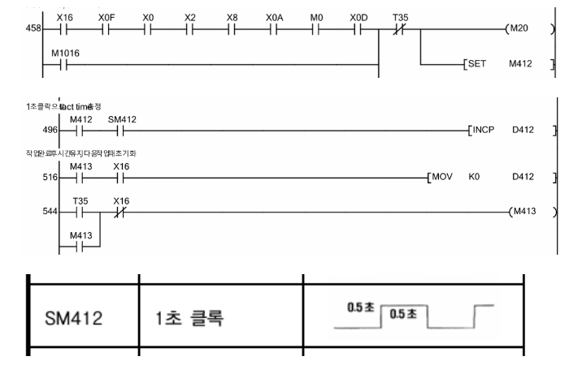

Initially, PLC internal clock data was considered, but there was an issue where time values were not converted reliably.  
Therefore, the final implementation uses the 1-second clock special relay `SM412`.

### Tact Time Operation Logic

1. Work start button `X16` is pressed
2. Tact Time measurement starts
3. `SM412` turns ON every second
4. `D412` increases by 1 every second
5. `D412` is displayed on the HMI as the elapsed work time
6. The measured time remains after the operation ends
7. When the next operation starts, `D412` is reset and measurement starts again

---

## 15. Troubleshooting

## 15.1 Tact Time Measurement Issue

> The following troubleshooting image is provided in Korean only.

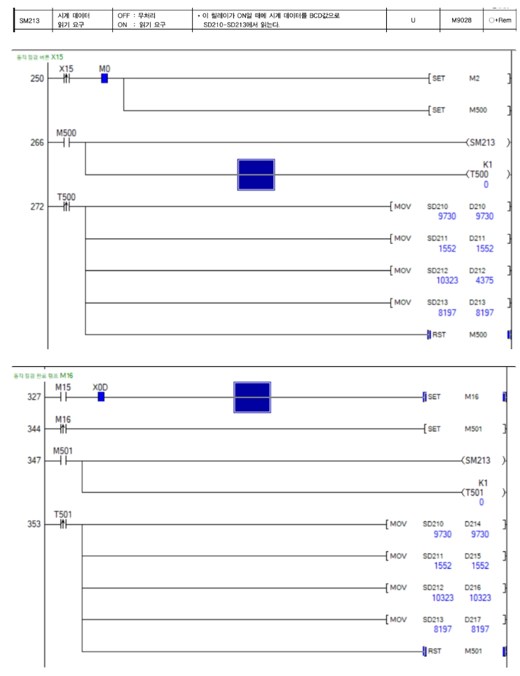

### Problem

At first, PLC internal clock data was used to calculate the time difference between the start and end of the operation.  
However, the time data did not match the actual work duration.

For example, the actual operation check took about 13 seconds, but the BCD/hex conversion result did not match the actual time.

### Cause

PLC internal clock data was not convenient for directly measuring short operation intervals, and some values appeared to be mixed or unstable.

### Solution

The measurement method was changed.

- Stop using internal clock data
- Use the `SM412` 1-second clock
- Accumulate seconds in `D412`
- Display `D412` as Tact Time on the HMI

---

## 15.2 Servo Position Error Based on Material Count

> The following troubleshooting image is provided in Korean only.

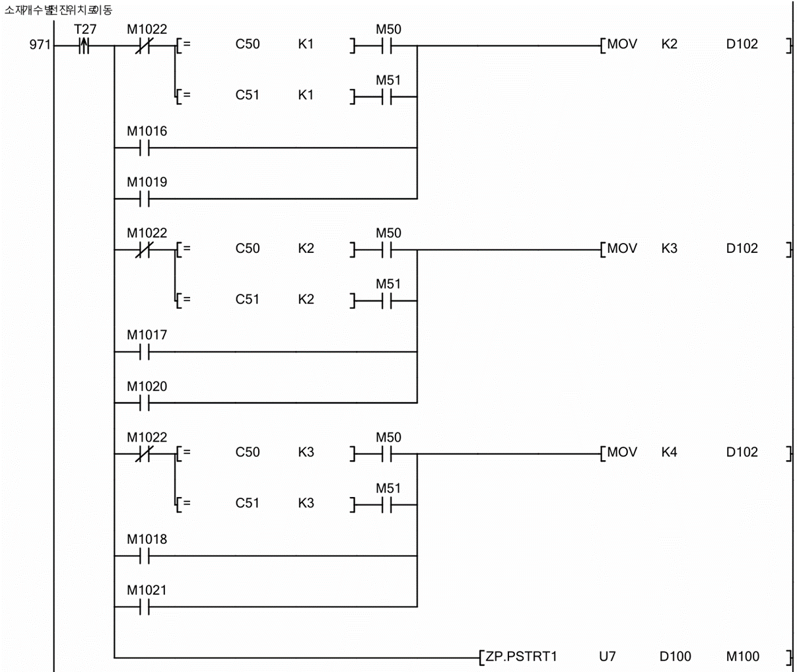

### Problem

A problem occurred when selecting a servo position using the `C50` and `C51` counter values.

Example case:

- The system needed to store the 3rd metal material
- One non-metal material had already been stored
- The `C51 = K1` condition was satisfied
- Due to the PLC scan order, an incorrect condition was executed first
- The servo motor moved to an unintended position

### Cause

The existing logic checked only the counter value.  
It did not check whether the current material was metal or non-metal.

Since PLC ladder programs are scanned from top to bottom, a condition for another material type could be satisfied first and cause incorrect positioning.

### Solution

The current material classification memory was added to the position movement condition.

- Add `M50` to metal position movement conditions
- Add `M51` to non-metal position movement conditions

The servo motor moves to the corresponding position only when the following two conditions are both satisfied:

```text
Current material type condition
+
Current material count condition
```

---

## 16. Operation Precautions

The default automatic operation determines the storage position according to material type and count.

Therefore, if the default automatic operation is started immediately after Selective Storage, the system may try to store two materials in the same position.

### Example

1. A non-metal material is stored in the 1st-floor metal position using Selective Storage
2. The default automatic operation is started
3. The first metal material moves to the 1st-floor metal position
4. The system tries to store another material in a position that is already occupied
5. A warehouse collision or equipment fall may occur

For this reason, the following precautions are required:

- After Selective Storage, the next operation should also be performed using Selective Storage
- After Selective Empty, the following operation should also be performed carefully using selective operation
- Before automatic operation, check the warehouse storage lamps on the HMI

---

## 17. Maintenance Manual Summary

This system automatically classifies materials as metal or non-metal and stores them in the assigned warehouse position according to the classification result.

Additional functions include:

- Manual JOG control
- Servo position Teaching
- Processing time setting
- Processing repeat count setting
- Material re-input waiting time setting
- HMI monitoring
- Selective storage
- Selective empty
- Full empty
- Emergency stop and emergency reset

When power is supplied, the servo motor automatically returns to the origin, and all cylinders move to their initial positions.  
Therefore, the area around the equipment must be cleared before supplying power.

The system becomes ready when the following conditions are satisfied:

- Servo origin is established
- All cylinders are backward
- Material supply is detected

The HMI displays servo position, servo speed, warning number, error number, material classification state, material count, work status message, and Tact Time in real time.

---

## 18. Demo

> Demo GIFs contain Korean labels only.

### Operation Check


### Automatic Operation

[Watch Full Automatic Operation Video](https://drive.google.com/file/d/1w_E2pjcpxAljvRO91MlLiYkNVass84lW/view?usp=sharing)

### Selective Storage


### Full Empty


### Selective Empty


### Emergency Stop


---

## 19. Skills and Lessons Learned

Through this project, I learned and applied the following skills:

- PLC-based sequence control
- Mitsubishi Q Series PLC programming
- GX Works2 ladder programming
- GT Designer3 HMI screen design
- Servo motor position control
- QD77MS2 positioning module usage
- Sensor-based material classification
- Cylinder and motor interlock logic
- Emergency stop logic
- Manual JOG and Teaching logic
- Tact Time measurement
- HMI-based monitoring and parameter control
- Troubleshooting PLC scan-order issues
